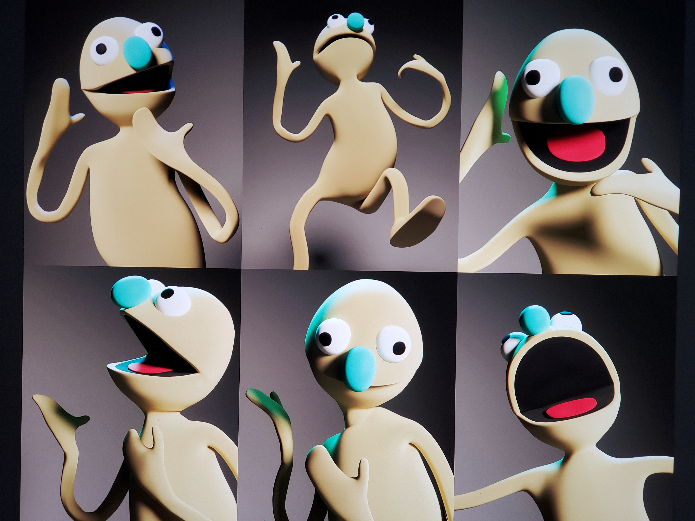

# puppet
realtime henson-like puppet with threejs and rapier, project at [Recurse Center](http://www.recurse.com)

### Plan for commits:
- [x] establish repo
- [x] project basic setup (vite, threejs, rapier3d)
- [x] sample threejs scene with lil-gui over top
- [ ] import rigged puppet and place puppet in threejs scene
- [ ] ragdoll puppet with rapier3d
- [ ] set up impulse joints connected to lil-gui
- [ ] set up webhid controller connection in between joints & lil-gui readout

### The puppet
- The puppet was modeled by the talented [Anthony Palumbo](https://anthonypalumboillustration.com/)
. The rig didn't import to Blender so I re-rigged it with puppetry mechanics (ex. an invisible arm up its butt)

### The stack I used
- node - whatever it is node does
- vite - server
- threejs - 3d rendering
- rapier3d - controlling the rig, ragdolling
- Blender - rigging the model

### AI
I was trying to learn, so I coded this by hand. I used AI to: 
- debug (point it at my project directory/file and ask why it's not working)
- draft a tutorial based on a github project's commits so I could work through rebuilding the project
- give instructions sometimes

### Resources I used making this:
- [CGDive Blender Rigging Tuts](https://www.youtube.com/@CGDive)
- [viridia/demo-rapier-three](https://github.com/viridia/demo-rapier-three)
- [nondebug/dualsense](https://github.com/nondebug/dualsense)
- my batchmates at [Recurse Center](http://www.recurse.com)
