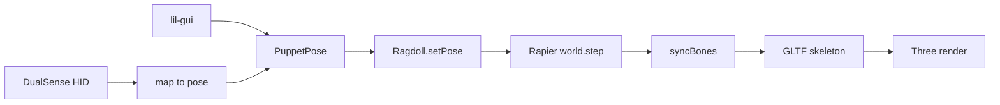

# Puppet maintainability refactor

This is a ~2,000-line Recurse prototype. The simulation already works. The problem is that [src/Engine.ts](src/Engine.ts) is the whole app (scene, GUI, DualSense mapping, physics loop), [src/ragdoll/Ragdoll.ts](src/ragdoll/Ragdoll.ts) mixes body construction with pose driving, and DualSense state lives on `window.dshid`.

The refactor is **extract and name**, not a rewrite. Each step should still run in the browser. Do not add an event bus, abstract “systems,” or a 20-file folder tree — that would make a learning project harder to follow.

## Current flow (keep this, just make it visible)




Today most of that lives in `Engine.ts`. After the split, a newcomer should be able to open `src/main.ts` and see those arrows as imports.

## Target layout

Keep related physics together. New folders only where there is a real seam.

```
src/
  main.ts                      # single entry: CSS, setup, animation loop
  style.css
  assets/                      # glb + backdrop (unchanged)
  app/
    params.ts                  # gravity / freeze / ragdoll / debug flags
    tunables.ts                # pose limits, deadzones, camera, damping
  scene/
    createScene.ts             # camera, lights, renderer, orbit, resize
    backdrop.ts
    armGuide.ts
  character/
    Puppet.ts                  # move from src/Puppet.ts
  ragdoll/
    Ragdoll.ts                 # pose apply, freeze, syncBones, clamp
    buildRagdoll.ts            # extract constructor body/joint creation
    skeletonConfig.ts          # rename fromBones.ts (it is not bone-derived)
    pose.ts                    # keep
    config.ts                  # keep
    reach.ts                   # shared plane projection / pinch / clamp
  input/
    dualsenseHid.js            # trimmed vendor parser (BT 0x31 + connect)
    dualsense.ts               # typed DualSenseState, no window.dshid
    mapDualSense.ts            # DualSense + dt + camera → pose
  ui/
    debugGui.ts
  physics/rapier.ts            # keep
  debug/RapierDebugRenderer.ts # keep
```

**Dependency rule:** `input` and `ui` write `PuppetPose`. `ragdoll` reads pose and talks to Rapier. `character` owns the GLTF/skeleton. `scene` never imports ragdoll. `Ragdoll` takes a thin `{ skeleton }` instead of the full `Puppet` class.

## What we will not do

- Full DualSense HID rewrite in TypeScript (CRC, USB reports, rumble/LED). That is vendor protocol, not puppet logic. Wrap it, delete dead paths.
- Splitting `Ragdoll` into six tiny files. Constructor vs runtime is enough.
- Tests as a first deliverable. After extraction, `mapDualSense` and `reach` become unit-testable; add those later if wanted.
- Changing how the puppet feels. Magic numbers move into [src/app/tunables.ts](src/app/tunables.ts), they do not get retuned.

## Phase 1 — Housekeeping so the entry point is honest

Small, safe, makes later moves easier.

- Point [index.html](index.html) at `src/main.ts`; import [src/style.css](src/style.css) from there. Delete the unused Vite scaffold in current `main.ts` and empty [src/lib/index.ts](src/lib/index.ts).
- Drop unused `postprocessing` if nothing imports it.
- Delete commented ground collider, unused `params.density/ox/oy/oz`, unused `groups` import, `console.log`s, and the unused `maxTravel` helper in DualSense mapping.
- Fix the `Vector3` bug at [src/Engine.ts](src/Engine.ts) L115 (`new THREE.Vector2(0, 2, 0)`).
- Wire `pose.thumbDeg` into IK-mode mouth so DualSense/GUI mouth works in both modes (today only ragdoll mode uses `pose.thumbDeg`).
- Enable TypeScript `strict` incrementally as files are extracted (start with new files typed; do not boil the ocean in `Ragdoll` on day one).

## Phase 2 — Peel Engine into scene + UI + loop

Leave DualSense mapping in place for one more step so the app still runs.

Extract from [src/Engine.ts](src/Engine.ts):

- `createScene.ts`: camera `(0,3,4)`, lights, renderer, OrbitControls, resize (today L229–275, L341–344, L378–382).
- `backdrop.ts` / `armGuide.ts`: the RC photo plane and hidden reach plane (L282–317).
- `debugGui.ts`: `makeGui()` (L36–77). Bind to `pose` + `params` via callbacks, not module-level `gui`/`ragdoll` closures.
- `params.ts` + `tunables.ts`: gather duplicated limits (mouth 90–150, head ±45/±80/±35, stick deadzone `0.12`, gyro dead `80`, thumb bind `92`, arm segment count `16`).

What remains in `main.ts` should look like:

```ts
await setup()           // rapier world, puppet, ragdoll, gui, hid connect
renderer.setAnimationLoop((t) => {
  applyDualSense(dt)
  if (params.ragdoll) ragdoll.setPose(pose, dt, armGuide)
  world.step()
  ragdoll.clampArmSpeed()
  params.ragdoll ? ragdoll.syncBones(puppet) : puppet.updateIk()
  debug.update()
  renderer.render(scene, camera)
})
```

That loop order is the contract. Do not reorder it.

## Phase 3 — DualSense as typed input, mapping as its own module

This is the highest-value split. [src/Engine.ts](src/Engine.ts) L79–225 is control mapping mixed with physics queries (`ragdoll.bodies`, `armGuidePlane`, `camera`).

1. Trim [src/dualsenseTrimmed.js](src/dualsenseTrimmed.js) to what the app uses: connect/open, Bluetooth report `0x31` field assignment, disconnect. Remove dead USB parsers, demo-DOM `initializeUI`, unused output/rumble RAF loop, `window.crcTable` if unused.
2. Add `input/dualsense.ts` that owns a `DualSenseState` object (sticks, triggers, gyro/accel, buttons). `requestDevice` / `checkForGrantedDevices` write that object, not `window.dshid`.
3. Move mapping to `input/mapDualSense.ts`: `(state, dt, ctx) => void` mutating `pose`. Context is `{ camera, armGuide, ragdoll }` only where currently required (L1 look-at, hand reach).
4. Pull duplicated plane-projection / reach-sphere math into `ragdoll/reach.ts` and use it from both the mapper (Engine L164–214) and `Ragdoll.setHandTargets` (L434–474).

Keep DualSense as `.js` behind a typed facade. Porting the HID parser is optional later and not part of this plan.

## Phase 4 — Ragdoll: construction vs runtime

[src/ragdoll/Ragdoll.ts](src/ragdoll/Ragdoll.ts) constructor is ~L41–307 (bodies, colliders, joints, hand targets, arm length). Runtime is `setPose` / motors / `syncBones` / freeze / clamp.

- Extract constructor into `buildRagdoll.ts` returning `{ bodies, joints, handTargets, binds, armLength, handRest, restWorldQuaternion, boneOriginLocal }`. `Ragdoll` becomes the runtime driver.
- Rename `fromBones.ts` → `skeletonConfig.ts`. It is a hardcoded part/joint graph, not derived from bones.
- Type `bodies` / `joints` instead of `Map<string, any>`. Type `setPose(pose: PuppetPose, ...)`.
- Drop the duplicate `import RAPIER from '@dimforge/rapier3d'` (L6) — the constructor already receives `RAPIER` from `getRapier()`.
- Pass `{ skeleton: THREE.Skeleton }` (or a tiny `BoneSource` interface) instead of `Puppet`, so physics does not depend on IK/GLTF loading.
- Move collider sizes, damping, and motor stiffness into `tunables.ts` with comments pointing at “jello-ness” (today split between `fromBones.ts` L62–63 and Ragdoll L118–128, L255–260).

Do **not** invent a generic ragdoll engine. Bone names (`puppeteer_wrist`, `arm.L.1`…`16`) stay as the character contract; just document them next to `skeletonConfig.ts`.

## Phase 5 — Character + docs

- Move [src/Puppet.ts](src/Puppet.ts) to `character/Puppet.ts`. Split IK chain setup only if it stays noisy after the move (`makeArmIK` can stay on the class).
- Type `scene` as `THREE.Group` / `THREE.Object3D`; stop using `any`.
- Update [README.md](README.md): replace the stale DualSense/joints checkboxes with a short “how the loop works” section and a map of folders. Keep the Henson/Recurse flavor; this is still a learning repo.

## How to verify (each phase)

`npm run dev`, then:

- Scene still loads the puppet + RC backdrop; orbit camera works.
- lil-gui still drives mouth / head / freeze / ragdoll / drop.
- Toggle `ragdoll`: IK path vs physics sync both still work; mouth follows L2 / GUI in both modes.
- Connect DualSense (Bluetooth): head gyro/accel, left stick bounce, right-stick reach, R2 pinch, R1 rest capture, L1 look-at-camera.
- Debug physics overlay toggle still draws Rapier lines.

No visual retune. If the puppet feels different, the extract moved a number or reordered the loop — revert that part.

## Suggested commit slices (if you want git history to teach)

1. Entry + dead code + Vector3 + CSS
2. Scene / GUI / tunables extracted
3. DualSense facade + mapper + shared reach
4. Ragdoll builder vs runtime + rename config
5. Puppet move + README

That matches how the project was built and stays bisectable.
